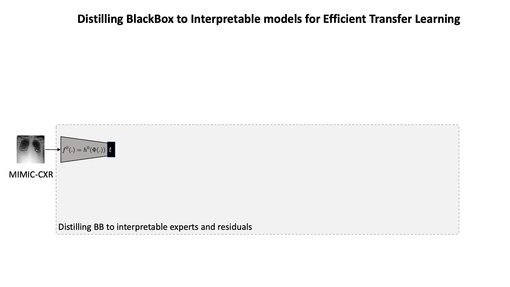

# Distilling BlackBox to Interpretable models for Efficient Transfer Learning #

### [Project Page](https://shantanu48114860.github.io/projects/MICCAI-2023-MoIE-CXR) | [Paper (Coming soon)]() | [arXiv](https://arxiv.org/abs/2305.17303) | [Video (Coming soon)]()

Official PyTorch implementation of the paper <br/>
**[Distilling BlackBox to Interpretable models for Efficient Transfer Learning]()** <br/>
[Shantanu Ghosh<sup>1</sup>](https://shantanu48114860.github.io/),
[Ke Yu<sup>2</sup>](https://gatechke.github.io/),
[Kayhan Batmanghelich<sup>1</sup>](https://www.batman-lab.com/)
<br/>
<sup>1</sup>BU ECE, <sup>2</sup>Pitt ISP <br/>
In [MICCAI, 2023](https://conferences.miccai.org/2023/en/), Early accept (acceptance rate ~ 14%) <br/>

## Table of Contents

1. [Objective](#objective)
2. [Environment setup](#environment-setup)
3. [Downloading data](#downloading-data)
    * [(b) Downloading MIMIC-CXR](#a-downloading-mimic-cxr)
    * [(b) Downloading Stanford-CXR](#b-downloading-stanford-cxr)
4. [Preprocessing MIMIC-CXR](#preprocessing-mimic-cxr)
5. [Training MoIE-CXR](#training-moie-cxr)
    * [(a) Running MoIE-CXR](#a-running-moie-cxr)
    * [(b) FOLs for MoIE-CXR](#b-fols-for-moie-cxr)
    * [(c) Checkpoints MoIE-CXR](#c-checkpoints-moie-cxr)
6. [Finetune for Stanford-CXR](#generated-local-explanations)
    * [(a) Finetuned checkpoints of Stanford-CXR](#a-finetuned-checkpoints-of-stanford-cxr)
    * [(b) Generating dataset for Semi-supervised learning (SSL)](#b-generating-dataset-for-semi-supervised-learning-ssl)
    * [(c) Finetuning MoIE-CXR for transfer learning](#c-finetuning-moie-cxr-for-transfer-learning)
    * [(d) Generate FOLs for the samples of Stanford-CXR](#d-generate-fols-for-the-samples-of-stanford-cxr)
8. [Suggestions](#suggestions)
9. [How to Cite](#how-to-cite)
10. [License and copyright](#license-and-copyright)
11. [Contact](#contact)

## Objective

In this paper, we aim to apply MoIE (in ICML, 2023) to Chest-X-rays (MIMIC-CXR). Due to class imbalance in large CXR
datasets, early experts in MoIE tend to cover all samples with disease present while ignoring disease subgroups and
pathological heterogeneity. We address this problem by estimating the class-stratified coverage from the total data
coverage. Then we utilize our method for efficient transfer learning to a target domain (Stanford-CXR). Illustration of our method is summarized below:

<br/>

## Environment setup

```bash
conda env create --name python_3_7_rtx_6000 -f environment.yml
conda activate python_3_7_rtx_6000
```

## Downloading data

After downloading data from the below links, search for `--data-root` variable in the codebase and replace the
appropriate paths for all the different datasets. Also search for `/ocean/projects/asc170022p/shg121/PhD/ICLR-2022`
and replace with appropriate paths.

### (a) Downloading MIMIC-CXR

- [MIMIC-CXR](https://physionet.org/content/mimic-cxr-jpg/2.0.0/)
- [RadGraph](https://physionet.org/content/radgraph/1.0.0/)
- [NVIDIA Annotation](https://github.com/leotam/MIMIC-CXR-annotations)
- [Chest ImaGenome](https://physionet.org/content/chest-imagenome/1.0.0/)

For more details please follow the [AGXNet Repository](https://github.com/batmanlab/AGXNet).

### (b) Downloading Stanford-CXR

For downloading, Stanford-CXR, visit the [link](https://stanfordmlgroup.github.io/competitions/chexpert/).

## Preprocessing MIMIC-CXR

To preprocess MIMIC-CXR to generate the concepts from the reports, follow the following steps sequentially:

1. To generate itemized RadGraph examples, run:

``` python
python ./src/codebase/data_preprocessing/mimic-cxr/miccai-main/preprocessing/radgraph_itemized.py
```

2. Run `./preprocessing/radgraph_parsed.py` To parse RadGraph relations, run:

``` python
python ./src/codebase/data_preprocessing/mimic-cxr/miccai-main/preprocessing/radgraph_parsed.py
```

3. To create adjacency matrix that represents the relations between anatomical landmarks and observations mentioned in
   radiology reports, run:

``` python
python ./src/codebase/data_preprocessing/mimic-cxr/miccai-main/preprocessing/adj_matrix.py
```

Step 3 will be the concepts for training MoIE-CXR. For more details please follow
the [AGXNet Repository](https://github.com/batmanlab/AGXNet).

## Training MoIE-CXR

### (a) Running MoIE-CXR

* As a first step find and replace the project path `/ocean/projects/asc170022p/shg121/PhD/ICLR-2022` from the whole
  codebase with appropriate path.
* Go the `./scripts/scripts_mimic_cxr` folder and get the training scripts. For all the diseases in for **MIMIC-CXR**,
  one script is included in the respective folder with proper instructions to run **1) Blackbox 2) projection (t) 3)
  interpretable model (g) 4) residual (r)**. **For example, to run `cardiomegaly` for **MIMIC-CXR**, refer to the
  file [`./scripts/scripts_mimic_cxr/cardiomegaly/cardiomegaly.sh`](./src/scripts/scripts_mimic_cxr/cardiomegaly/cardiomegaly.sh)**
* The naming convention and the paths to be replaced is mentioned in the script. Follow them carefully
* Run them sequentially.
* Also, after `test_t_mimic_cxr.py`, sub-select the concepts whose validation auroc >= 0.7 using the notebooks for each
  disease in the folder [`./src/codebase/jupyter_notebook/MIMIC-CXR`](./src/codebase/jupyter_notebook/MIMIC-CXR).
* Also, after training and testing each expert in
  MoIE-CXR, [`FOLs_mimic_cxr_main.py`](./src/codebase/FOLs_mimic_cxr_main.py) file is responsible for generating
  instance specific FOL. This file
  uses [`./src/codebase/MIMIC_CXR/paths_mimic_cxr.json`](./src/codebase/MIMIC_CXR/paths_mimic_cxr.json)
  file where we keep all the paths and filenames of the checkpoints of Blackbox (bb), concept predictor (t), explainer (
  g), and residual (r) for each disease. Replace those paths and filenames with the appropriate ones based on the
  experiments.

### (b) FOLs for MoIE-CXR

We have included the instance-specific explanations per expert for each disease of MIMIC-CXR for 0<sup>th</sup> seed in
the folder [`./explanations`](./explanations/mimic-cxr). For example, to see the FOLs for **cardiomegaly**, refer to
`actual_explanations` column of [`./explanations`](./explanations/mimic-cxr/cardiomegaly).

### (c) Checkpoints MoIE-CXR

For the checkpoints of 0<sup>th</sup> seed of the pretrained blackboxes and concept banks of different diseases of
MoIE-CXR, refer below:

| Blackbox (BB)                                                                                | Concept predictor (t) / Concept banks                                                        |
|----------------------------------------------------------------------------------------------|----------------------------------------------------------------------------------------------|
| [Cardiomegaly](https://drive.google.com/drive/u/1/folders/1oZ5cfgbm5HWf8yaWY55MWcubMRolrk3E) | [Cardiomegaly](https://drive.google.com/drive/u/1/folders/1fr4MgLYYQtl9bLnkKJTUqao_NPEMGC7m) |
| [Effusion](https://drive.google.com/drive/u/1/folders/1cuB_RamvNAhcF5SaM4MfA3WS8uDtSoNM)     | [Effusion](https://drive.google.com/drive/u/1/folders/1FRc_pcz5pxUgnn1IrcOgfMEgTAdld6dN)     |
| [Edema](https://drive.google.com/drive/u/1/folders/1zfYOXXlPdQT8HW7qXQpEydjQWrO8iAnL)        | [Edema](https://drive.google.com/drive/u/1/folders/1yNgm-TqY1QDNVWrBG32AtJSLJdxUk45e)        |
| [Pneumonia](https://drive.google.com/drive/u/1/folders/1cVNOrakP-Rkr6lwynRVBrogORP4kMQ44)    | [Pneumonia](https://drive.google.com/drive/u/1/folders/1kYqiuGT62HkBVWMZ_kimY4-sRhAU5BT6)    |
| [Pneumothorax](https://drive.google.com/drive/u/1/folders/1l1yyjfghXny_nxO7YsquJ04R15XQMkqf) | [Pneumothorax](https://drive.google.com/drive/u/1/folders/1UhEwz4nGVRGAVbPveEPAdC8ylP03Pbas) |

## Finetune for Stanford-CXR

### (a) Finetuned checkpoints of Stanford-CXR

Refer to the [link](https://drive.google.com/drive/u/1/folders/13rO09zBKiZwni7fksk74b9rav_sriXY3) for the finetuned BB
of Stanford-CXR.

### (b) Generating dataset for Semi-supervised learning (SSL)

As mentioned in the Algorithm 1, we need to generate the concepts for Stanford-CXR using Semi-supervised learning (SSL),
as Stanford-CXR does not have any concept annotations or radiological reports associated to it. Also, to prove
MoIE-CXR's efficiency, we use a subset of training data of Stanford-CXR. Refer to
the [link](https://drive.google.com/drive/u/1/folders/1Kzt3WQPqbei2407wpqOUYOCYubeQETcK) to get csvs with details of the
subset of 5000, 11000, 15000, 20000 and 30000 training samples of Stanford-CXR and place it in the directory
`Path/out/stanford_cxr/BB/lr_0.01_epochs_5_loss_CE/densenet121/<disease>`. For example, to get the details of 15000
training samples of cardiomegaly of Stanford-CXR, place the `master_tot_15000.csv` file in the directory
`Path/out/stanford_cxr/BB/lr_0.01_epochs_5_loss_CE/densenet121/cardiomegaly`. The `lr` and the `epoch` in the path
is the learning rate and epoch at which the BB for Stanford-CXR has been trained. You can get it from the 1st command of
each script in the folder [`./src/scripts/scripts_stanford_cxr`](./src/scripts/scripts_stanford_cxr).

If you want to generate the csvs with the samples of Stanford-CXR, here is an example command to generate and save the details of
30000 samples from the training data of Stanford-CXR:

```
python .src/codebase/prepare_df_SSL_main.py \
  --dataset="stanford_cxr" \
  --disease="cardiomegaly" \
  --pos_correct 2200 \
  --neg_correct 11600 \
  --pos_incorrect 15200 \
  --neg_incorrect 1000
```

While training using SSL, `master_tot_15000.csv` file is required in the dataloader for the training script in
[`./src/codebase/train_t_ssl_main.py`](./src/codebase/train_t_ssl_main.py). Here are the details of the
*argparse* variables:

* `--disease`: disease in Stanford-CXR.
* `--pos_correct`: Correctly classified training samples with the disease (y=1) of Stanford-CXR using the finetuned BB
  from MIMIC-CXR.
* `--neg_correct-root`: Correctly classified training samples without the disease (y=0) of Stanford-CXR using the
  finetuned BB from MIMIC-CXR.
* `--pos_incorrect`: Incorrectly classified training samples with the disease (y=1) of Stanford-CXR using the finetuned
  BB from MIMIC-CXR.
* `--neg_incorrect`: Incorrectly classified training samples without the disease (y=0) of Stanford-CXR using the
  finetuned BB from MIMIC-CXR.

These 4 numbers will add up to `--tot_samples` in the subsequent scripts in next stage.

### (c) Finetuning MoIE-CXR for transfer learning

* Go the [`./src/scripts/scripts_stanford_cxr`](./src/scripts/scripts_stanford_cxr) folder and get the training scripts.
  For all the diseases in for
  **Stanford-CXR**, one script is included in the respective folder with proper instructions to run **1) Blackbox 2)
  projection (t) 3)
  interpretable model (g) 4) residual (r)**. Fix the number of samples to be used as training data for Stanford-CXR. For
  example, to run `cardiomegaly` for **Stanford-CXR**, look into the
  file [`./src/scripts/scripts_stanford_cxr/cardiomegaly/car_15000.sh`](./src/scripts/scripts_stanford_cxr/cardiomegaly/car_15000.sh)
  and `./src/scripts/scripts_stanford_cxr/cardiomegaly/car_fl_15000.sh` to finetune the model and estimate the
  computation cost. **These two files use 15000 samples of Stanford-CXR for the finetuning**. To modify this number, use
  the following variable `--tot_samples` in those scripts.
* The naming convention and the paths to be replaced is mentioned in the script. Follow them carefully.
* Run them sequentially.
* Also, for training MoIE-CXR using the Stanford-CXR in the
  script, [`./src/codebase/train_explainer_cxr_domain_transfer.py`](./src/codebase/train_explainer_cxr_domain_transfer.py)
  , the variable `--initialize_w_mimic` signifies whether we finetune both the selectors (pi) and the experts (g) or
  not.
    * if `--initialize_w_mimic` == "y", we finetune both the selectors (pi) and the experts (g).
    * if `--initialize_w_mimic` == "n", we finetune only the selectors (pi), not the experts (g).

### (d) Generate FOLs for the samples of Stanford-CXR

Refer below for generating FOLs for the samples of Stanford-CXR where 15000 training samples were used for finetuning
for the disease edema. Modify `tot_samples` and `disease` for other configurations.

```
python ./src/codebase/FOL_cxr_domain_transfer.py --iteration 1 --disease "edema" --model "MoIE" --tot_samples 15000 --cov 0.4 --initialize_w_mimic "y"
python ./src/codebase/FOL_cxr_domain_transfer.py --iteration 2 --disease "edema" --model "MoIE" --tot_samples 15000 --cov 0.3 --initialize_w_mimic "y"
python ./src/codebase/FOL_cxr_domain_transfer.py --iteration 3 --disease "edema" --model "MoIE" --tot_samples 15000 --cov 0.3 --initialize_w_mimic "y"
```

## Suggestions

Most of the *argparse* variables are self-explanatory. However, in order to perform the experiments successfully, give
the correct paths and files to the following variables in `train_explainer_<dataset>.py`
and `test_explainer_<dataset>.py`.

* For `train_explainer_mimic_cxr.py` and `train_explainer_cxr_domain_transfer.py`, follow the rules:
    1. `--checkpoint-model` : Don't include this variable for the 1st iteration. For 2nd iteration and onwards, include
       the checkpoint files of all the experts of **previous iterations while training for the expert (
       g) (`--expert-to-train "explainer"`)**. For example: if the current iteration is 3, include the checkpoint files
       for the expert 1 and expert 2 sequentially. While **training the residual (`--expert-to-train "residual"`)**,
       include the checkpoint files of all the experts **including the current iteration**.
    2. `--checkpoint-residual` : Don't include this variable for the 1st iteration. For 2nd iteration and onwards,
       include the checkpoint files of all the residuals of **previous iterations** while training the expert (
       g) (`--expert-to-train "explainer"`) and the residual (`--expert-to-train "explainer"`). For example: if the
       current iteration is 3, include the checkpoint files for the residual 1 and residual 2 sequentially.
    3. `--prev_chk_pt_explainer_folder` : Don't include this variable for the 1st iteration. For 2nd iteration and
       onwards, include the folders of the checkpoint files of all the experts of **previous iterations**. For example:
       if the current iteration is 3, include the checkpoint folders for the expert 1 and expert 2 sequentially. For
       Include the experiment folder where the checkpoint file will be stored.


* For `test_explainer_mimic_cxr.py` and `test_explainer_cxr_domain_transfer.py`, follow the rules:

    1. `--checkpoint-model` : Don't include this variable for the 1st iteration. For 2nd iteration and onwards, include
       the checkpoint files of all the experts **including the current iteration** while testing the expert (
       g) (`--expert-to-train "explainer"`) and the residual (`--expert-to-train "explainer"`).
    2. `--checkpoint-residual` : Don't include this variable for the 1st iteration. For 2nd iteration and onwards,
       include the checkpoint files of all the residuals of **previous iterations** while training for the expert (
       g) (`--expert-to-train "explainer"`)**. For example: if the current iteration is 3, include the checkpoint files
       for the residual 1 and residual 2 sequentially. While **testing the residual (`--expert-to-train "residual"`)**,
       include the checkpoint files of all the residuals **including the current iteration**.
    3. `--prev_chk_pt_explainer_folder` : Don't include this variable for the 1st iteration. For 2nd iteration and
       onwards, include the folders of the checkpoint files all the experts of **previous iterations**. For example: if
       the current iteration is 3, include the checkpoint folders for the expert 1 and expert 2 sequentially. Include
       the experiment folder where the checkpoint file will be stored.

Also make sure the following variables are correct:

* `--cov`: Coverages of each iteration separated by a space as in the above commands.
* `--lr`: Learning rates of each expert separated by a space as in the above commands.
* `--data-root`: Dataset path of images, labels and concepts (if exists)
* `--logs`: Path of tensorboard logs

## How to Cite

```
@misc{ghosh2023distilling,
      title={Distilling BlackBox to Interpretable models for Efficient Transfer Learning}, 
      author={Shantanu Ghosh and Ke Yu and Kayhan Batmanghelich},
      year={2023},
      eprint={2305.17303},
      archivePrefix={arXiv},
      primaryClass={cs.CV}
}
```

## License and copyright

Licensed under the [MIT License](LICENSE)

Copyright © [Batman Lab](https://www.batman-lab.com/), 2023

## Contact

For any queries, contact: **shawn24@bu.edu**
